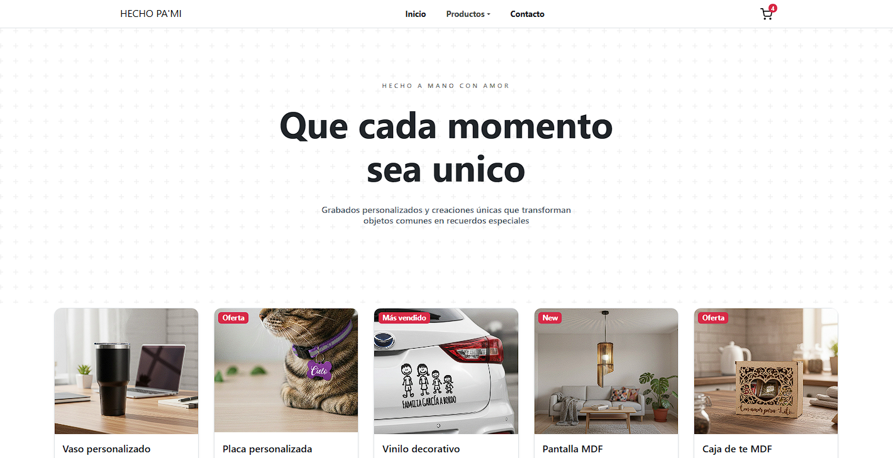

# 🌟 Hecho Pa'Mi

 
 
 

**Hecho Pa'Mi** es una aplicación web de comercio electrónico desarrollada en React, creada como proyecto práctico para el curso de Coder.  
Inspirada en mi emprendimiento personal, permite a los usuarios explorar productos, agregarlos al carrito y completar compras de forma sencilla e interactiva.  

📸 

---

## 🚀 Instalación

Sigue estos pasos para correr el proyecto en tu máquina local:

1. Clonar el repositorio
2. Entrar a la carpeta del proyecto con el comando `cd proyecto-reactJs-Kayla`
3. Ejecute el comando `npm install` para instalar dependencias y crear la carpeta `node_modules`
4. Levanta la app en tu entorno local: `npm run dev`

⚠️ **Importante:** Este proyecto utiliza **variables de entorno**, así que asegurate de configurarlas antes de ejecutar la app.

Para poder ejecutar la app, quien clone el proyecto deberá:  
1. Crear un archivo llamado `.env` en la raíz del proyecto.  
2. Agregar las variables necesarias (por ejemplo, las claves de Firebase).  
3. No subir este archivo a repositorios públicos, ya que contiene información sensible.

## 📝 Requisitos 

> Node.js versión v22.11.0

## 🌐 Versión en línea 

Si deseas ver el proyecto online, puedes utilizar el siguiente link [Hecho Pa'Mi]()

## 🛠 Librerías utilizadas

- [React Bootstrap](https://react-bootstrap.github.io/) Componentes y estilos predefinidos para diseño responsive.
- [React Icons](https://react-icons.github.io/react-icons/) Íconos para la interfaz.
- [React Router DOM](https://reactrouter.com/) Navegación entre rutas de la app.
- [Firebase](https://firebase.google.com/?hl=es-419) Base de datos y almacenamiento en la nube.
- [SweetAlert](https://sweetalert.js.org/) Alertas y notificaciones interactivas al usuario.

🧑‍💻  Desarrollado por Kay 💖

